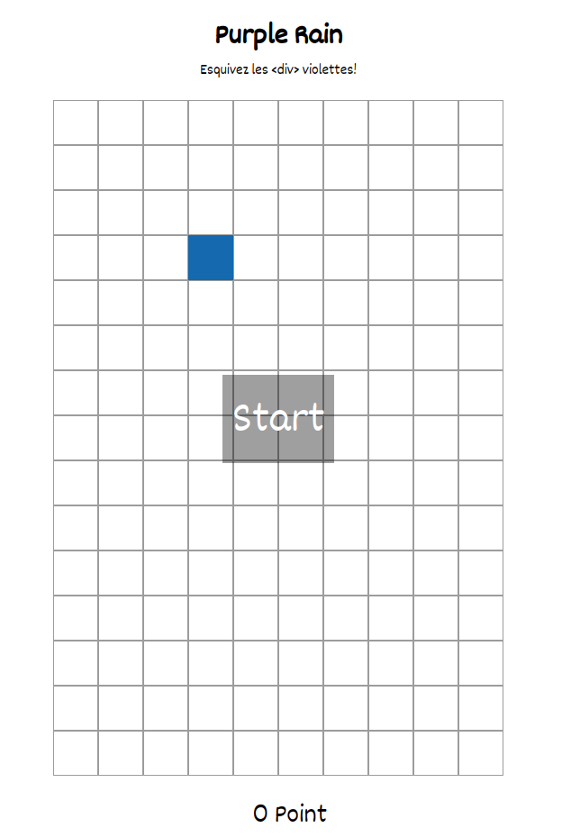

<h1 align="center">Purple Rain</h1>
<h3 align="center">Projet Angular-Node</h3>
 

    

### Comment installer ?
#### via NPM
Clonez le projet. Si Angular n'est pas installé, exécutez `npm install -g @angular/cli` .
 Executez ensuite `npm install`

Lanncez ensuite Angular en exécutant dans /frontend `ng serve --host 0.0.0.0`
 Lanncez Node exécutant dans /backend `npm start`

#### via Docker

Si vous avez Docker et docker-compose sur votre machine, clonez le projet et lancez à la racine du projet : `docker compose up --build -d`.

Allez sur `http://localhost:4200` et bonne visite!